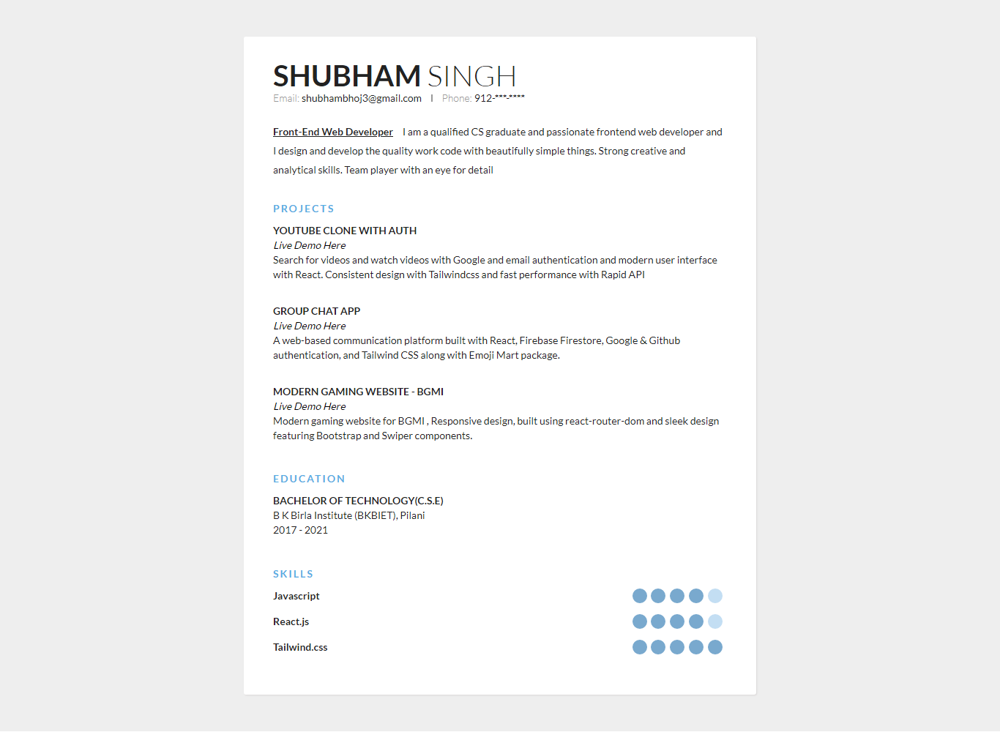
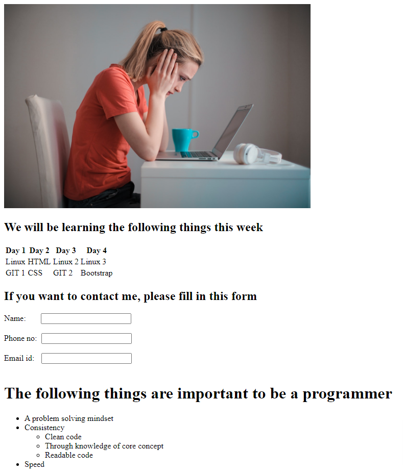
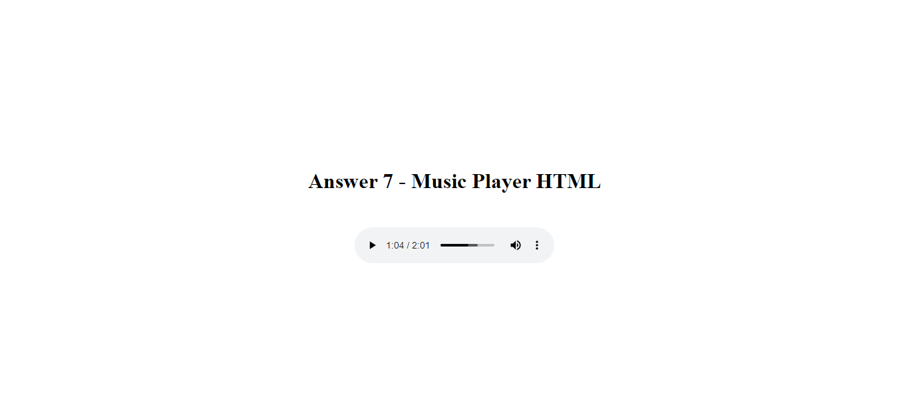

## ❄️ Answers - HTML Section ❄️

#### Here's the screencaptures of all the HTML projects.

### 📖 Answer 4 : Resume

[Code here: ]()

### 📖 Answer 5 : Layout

[Code here: ]()

### 📖 Answer 7 : Music Player

[Code here: ]()

### 📖 Answer 10 : Table

[Code here: ]()

